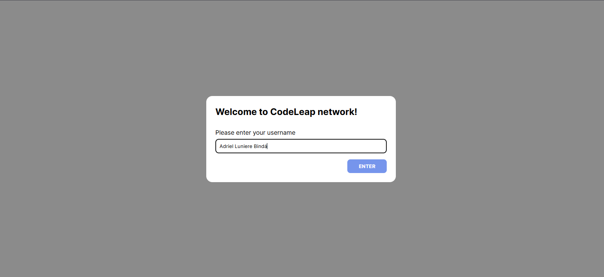
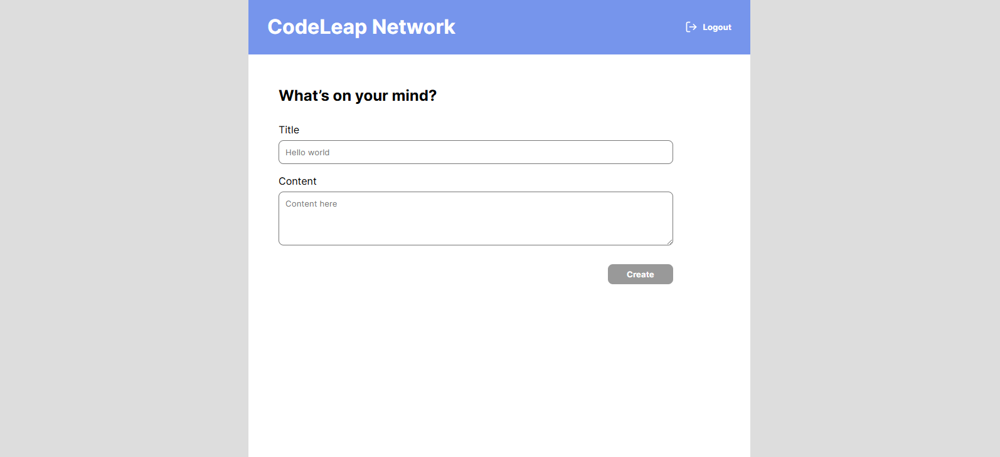
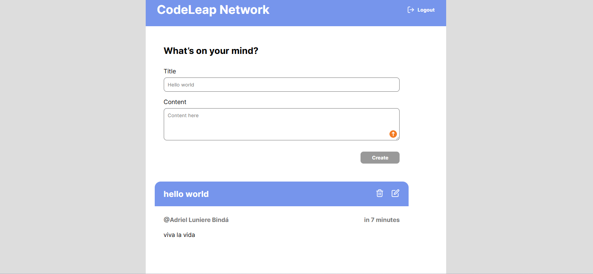
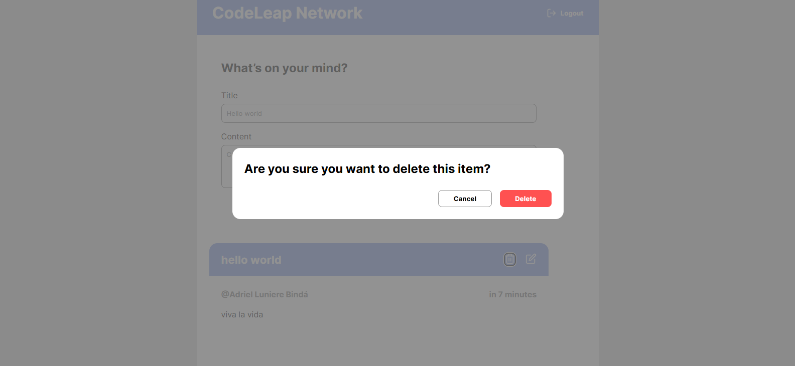

# 🌐 CodeLeap Network


A clean, high-performance social networking interface developed for the CodeLeap Fullstack Assessment. This project demonstrates modern React best practices, efficient state management, and a premium user experience.

---

## 📸 Project Demonstration

<div align="center">
  <video src="src/movie/Codeleap.mp4" poster="src/img/login.png" width="100%" controls>
    Seu navegador não suporta a tag de vídeo. 
    <a href="src/movie/Codeleap.mp4">Clique aqui para ver o vídeo direto.</a>
  </video>
  <p align="center"><i>Nota: O player de vídeo pode não renderizar na visualização (Preview) do VS Code, mas aparecerá normalmente quando você subir para o GitHub ou abrir no navegador.</i></p>
</div>

### 🖼️ Screenshots
| Login Screen | Main Feed |
| :---: | :---: |
|  |  |

| Edit Modal | Delete Confirmation |
| :---: | :---: |
|  |  |

---

## ✨ Key Features

- 👤 **Seamless Authentication**: Simple username-based session management using LocalStorage.
- 📜 **Infinite Scrolling**: Automated pagination using React Query's `useInfiniteQuery` for smooth browsing.
- 🛠️ **Full CRUD Operations**: Optimized Create, Read, Update, and Delete flows with instant UI updates.
- ⚡ **Optimized State Management**: Efficient caching and automatic re-fetching via TanStack Query.
- 📱 **Responsive & Fluid UI**: Fully responsive design with glassmorphism effects and smooth transitions.
- 🎨 **Premium Animations**: Micro-interactions and entry animations powered by Framer Motion.

---

## 🛠️ Technology Stack

| Category | Technology |
| :--- | :--- |
| **Core** | React 18 (Functional Components & Hooks) |
| **Build Tool** | Vite |
| **Data Fetching** | Axios + TanStack Query (React Query) |
| **Styling** | Vanilla CSS (Modern Design Tokens) |
| **Icons** | Lucide React |
| **Date Utils** | date-fns |
| **Animations** | Framer Motion |

---

## 🚀 Getting Started

### Prerequisites
- Node.js (v16.x or higher)
- npm or yarn

### Installation & Setup

1. **Clone the repository**
   ```bash
   git clone <repository-url>
   cd codeleap-fullstack-test
   ```

2. **Install dependencies**
   ```bash
   npm install
   ```

3. **Launch development server**
   ```bash
   npm run dev
   ```

4. **Production Build**
   ```bash
   npm run build
   ```

---

## 📡 API Integration

The application communicates with the **CodeLeap Careers API**:
`https://dev.codeleap.co.uk/careers/`

> [!IMPORTANT]
> **Trailing Slash Requirement**: The API strictly requires a trailing slash (`/`) on all endpoints. This project handles this automatically via an **Axios Interceptor** implemented in `src/services/api.js`.

---

## 🌍 Deployment

This project is optimized for deployment on **Vercel** or **Netlify**.

1. Connect your repository.
2. The platform will automatically detect the Vite config.
3. Deploy!

---

**Developed with ❤️ by Adriel Luniere**
